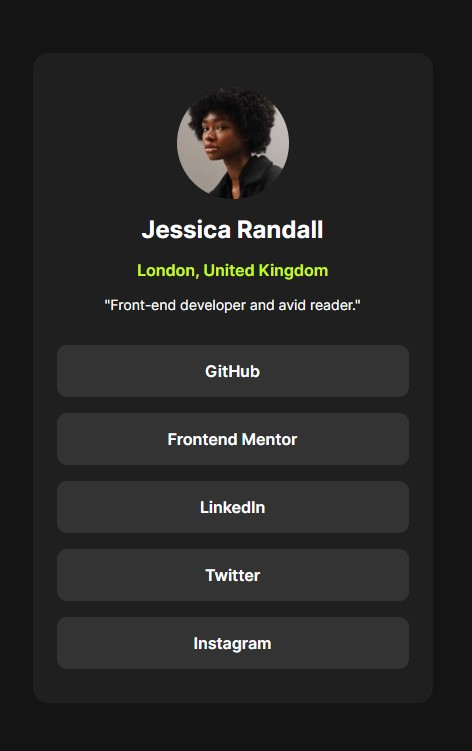

# Frontend Mentor - Social links profile solution

This is a solution to the [Social links profile challenge on Frontend Mentor](https://www.frontendmentor.io/challenges/social-links-profile-UG32l9m6dQ). Frontend Mentor challenges help you improve your coding skills by building realistic projects. 

## Table of contents

- [Overview](#overview)
  - [The challenge](#the-challenge)
  - [Screenshot](#screenshot)
  - [Links](#links)
- [My process](#my-process)
  - [Built with](#built-with)
  - [What I learned](#what-i-learned)
  - [Continued development](#continued-development)
  - [Useful resources](#useful-resources)
- [Author](#author)
- [Acknowledgments](#acknowledgments)

**Note: Delete this note and update the table of contents based on what sections you keep.**

## Overview

### The challenge

Users should be able to:

- See hover and focus states for all interactive elements on the page

### Screenshot




### Links

- Solution URL: [Add solution URL here](https://github.com/ArthKate/fmc-social-links-profile)
- Live Site URL: [Add live site URL here](https://arthkate.github.io/fmc-social-links-profile/)

## My process

### Built with

- Semantic HTML5 markup
- CSS custom properties
- Flexbox
- Mobile-first workflow

### What I learned

Use this section to recap over some of your major learnings while working through this project. Writing these out and providing code samples of areas you want to highlight is a great way to reinforce your own knowledge.

To see how you can add code snippets, see below:

```css
@media (min-width: 768px) {
  .wrapper {
    display: flex;
    justify-content: center;
    align-items: center;
    height: 100vh;
    background-color: var(--bg-Off-Black);
  }

  .profile-container {
    display: flex;
    justify-content: center;
    align-items: center;
    background-color: var(--bg-Dark-Grey);
    width: 400px;
    height: 650px;
  }
}
```

### Continued development

Am yet to gasp using CSS grid and using locally hosted font-files. I did give a shot to both of these but am yet to understand them full. Doing to do more research and attempt pulling off a project using these skills. 

### Useful resources


## Author

- Frontend Mentor - [@yourusername](https://www.frontendmentor.io/profile/ArthKate)
- Twitter - [@yourusername](https://twitter.com/arthkate)

**Note: Delete this note and add/remove/edit lines above based on what links you'd like to share.**

## Acknowledgments

This is where you can give a hat tip to anyone who helped you out on this project. Perhaps you worked in a team or got some inspiration from someone else's solution. This is the perfect place to give them some credit.

**Note: Delete this note and edit this section's content as necessary. If you completed this challenge by yourself, feel free to delete this section entirely.**
